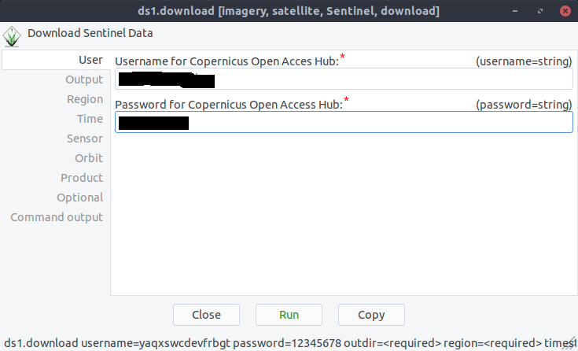
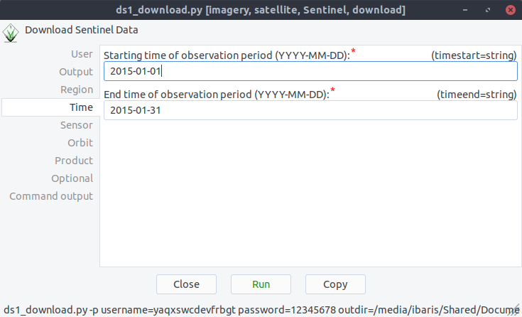
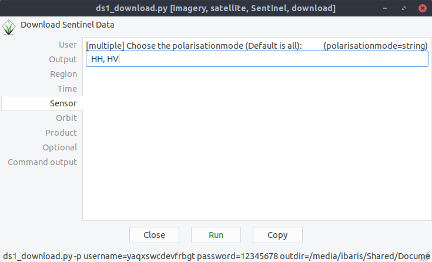
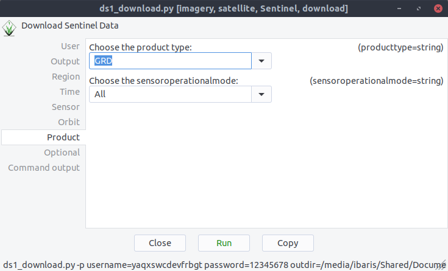
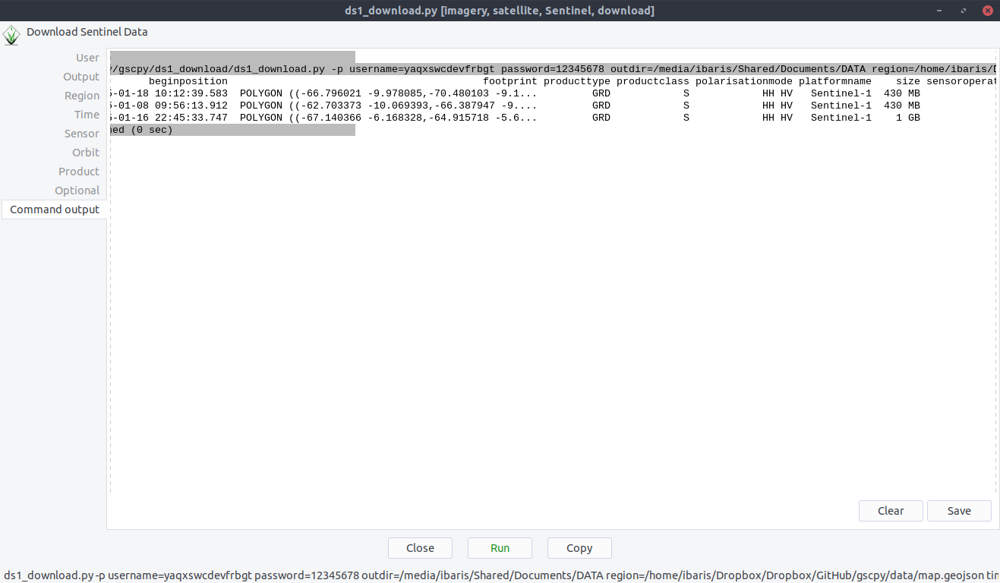

Sentinel 1 Downloader
---------------------
Here is an example of how to use the Sentinel downloader, to map all available data `(flag: -p)`::

    $ ds1.download -p username=DALEK password=exterminate region=myGEoJsOnFile.geojson timestart=2015-01-02
      timeend=2015-01-12 outdir='home/usr/data' producttype=SLC

Another way is to use the GUI:

Type your Username and Password:

After the definition of a region with a geojson file you can specify the sensing period, polarization and the
product type:

With `flag -p` you can print all available products. If the flag is missing all data will be downloaded:

