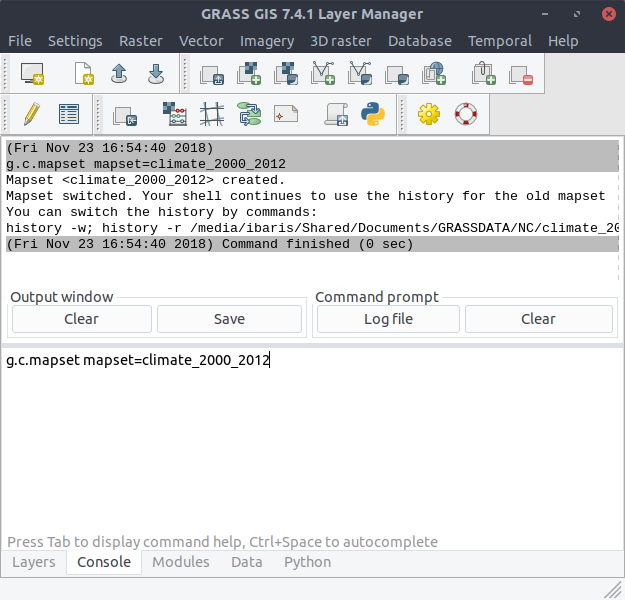
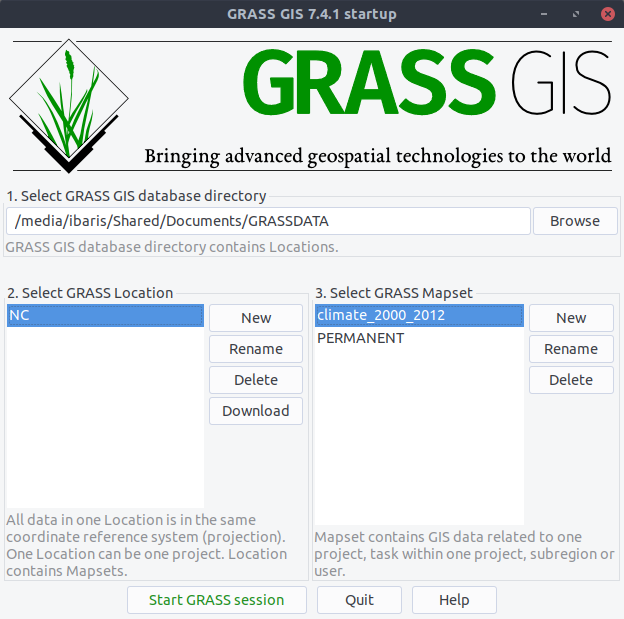

Create a Mapset
---------------
Start GRASS with a location and create a mapset `climate_2000_2012`. Therefore, one can use ``g.c.mapset``::

    $ g.c.mapset mapset=climate_2000_2012

After we start GRASS GIS new the created mapset is present:

