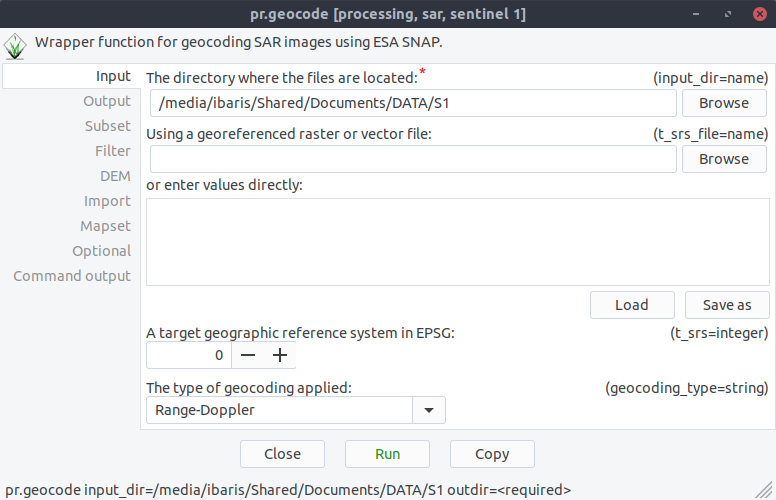
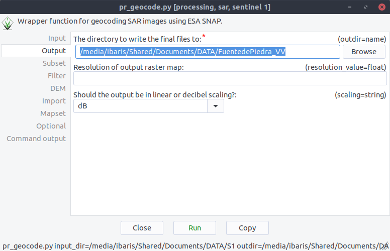
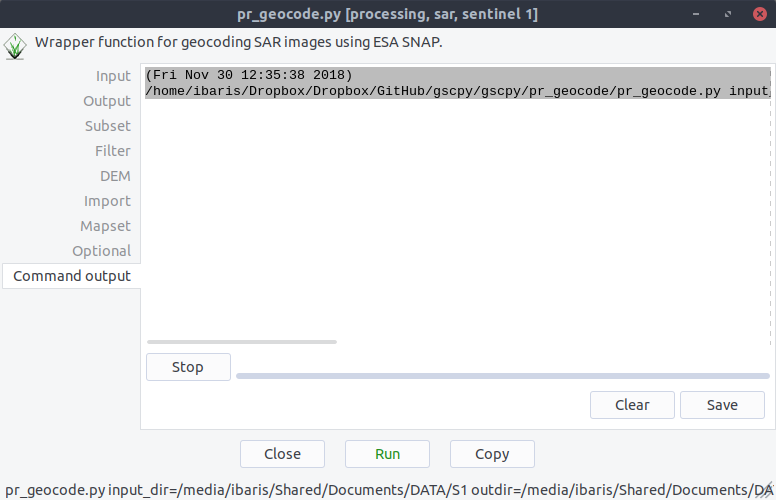

Geocoding Example
-----------------
After we downloaded the Sentinel 1 Files with ``ds1.download`` we want to geocode all the files automatically. Thus,
we start with command ``pr.geocode`` the geocode GUI. Now we can specify our directory where the sentinel data are:

After these we specify our output directory:

if we click on ``Run`` now the geocode processing will run with ESA´s SNAP software:

If there is any scene that is already processed the ``pr.geocode`` module will skip these files:

.. image:: _static/pr_geocode_1.png
   :scale: 50 %
   :alt: exist
   :align: center
