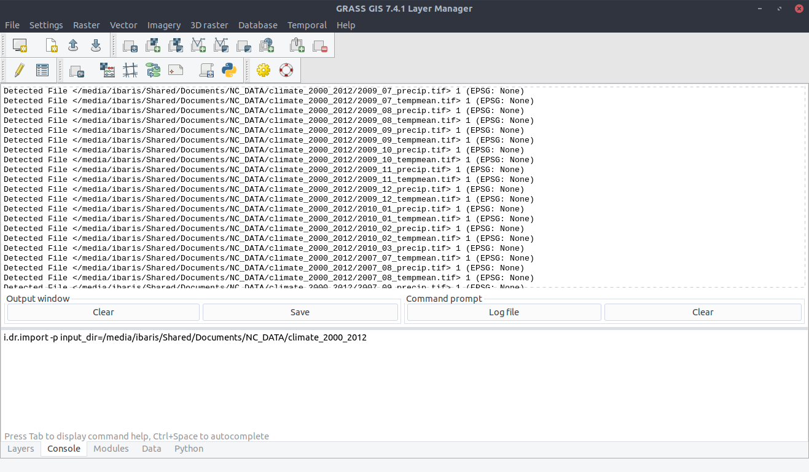
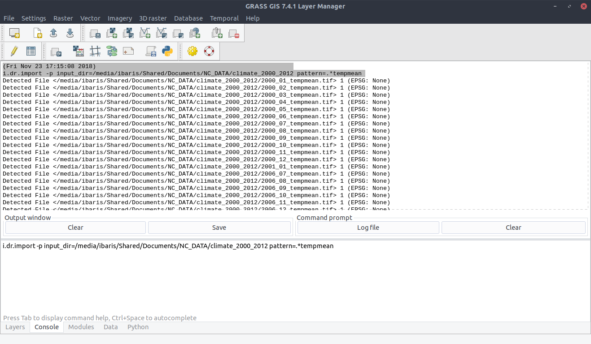
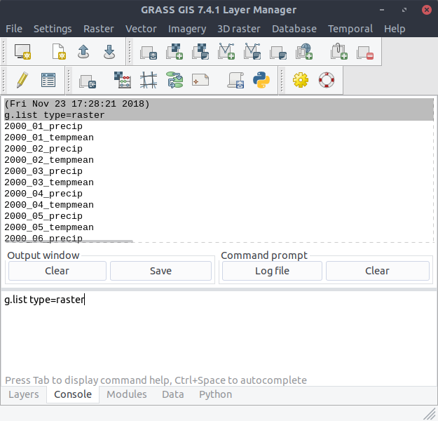
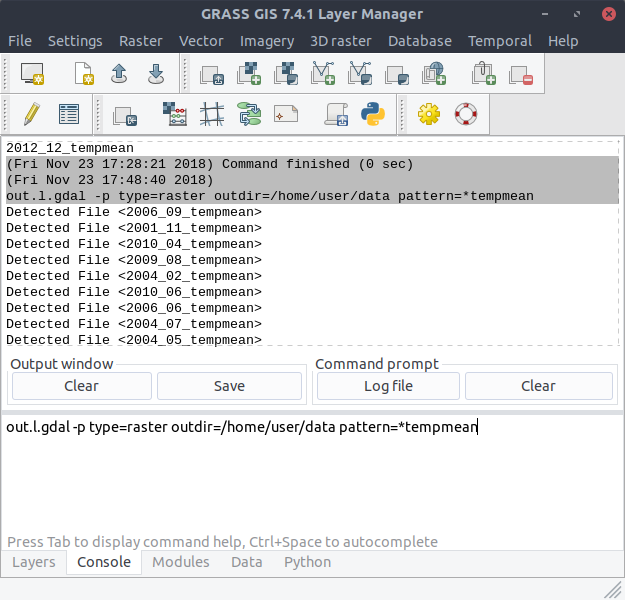

Import / Export Raster Files
----------------------------
After we downloaded the data (See section Data), we can list all available raster files within the directors
`climate_2000_2012`. We use the module ``i.dr.import``::

    $ i.dr.input -p input_dir=/media/ibaris/Shared/Documents/NC_DATA/climate_2000_2012

We can see now all files:

To show the ``pattern`` parameter of the module ``i.dr.import`` now we want to consider only files that has the string
`tempmean` in their filenames::

    $ i.dr.input -p input_dir=/media/ibaris/Shared/Documents/NC_DATA/climate_2000_2012 pattern=.*tempmean

With the command::

    $ i.dr.input input_dir=/media/ibaris/Shared/Documents/NC_DATA/climate_2000_2012

we can import all raster files located in `/media/ibaris/Shared/Documents/NC_DATA/climate_2000_2012`. To be sure
we can we can use the command::

    $ g.list type=raster

We could export all files with the command ``out.l.gdal`` like::

    $ out.l.gdal type=raster outdir=/media/ibaris/Shared/Documents/NC_DATA/climate_2000_2012

With the `flag: -p` we can see the files that will be exported:

