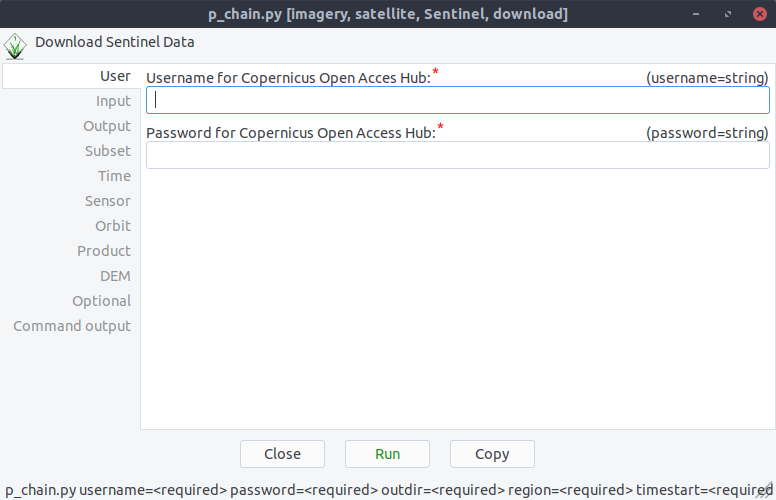

Download, Geocode and Import Chain
----------------------------------
It is also possible to run a processing chain with ``p.chain``::

    $ p.chain

Now you can input all the same things described in the single modules ``ds1.download`` and ``pr.geocode``

