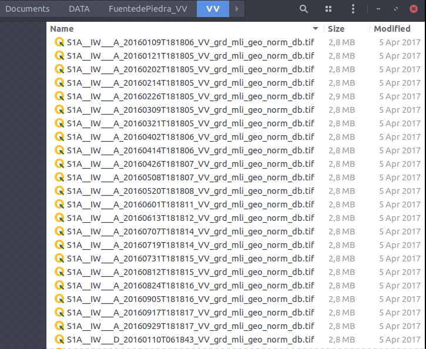
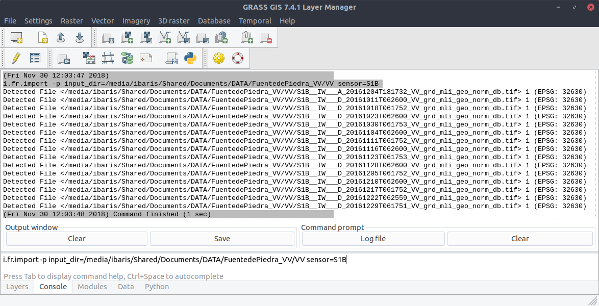
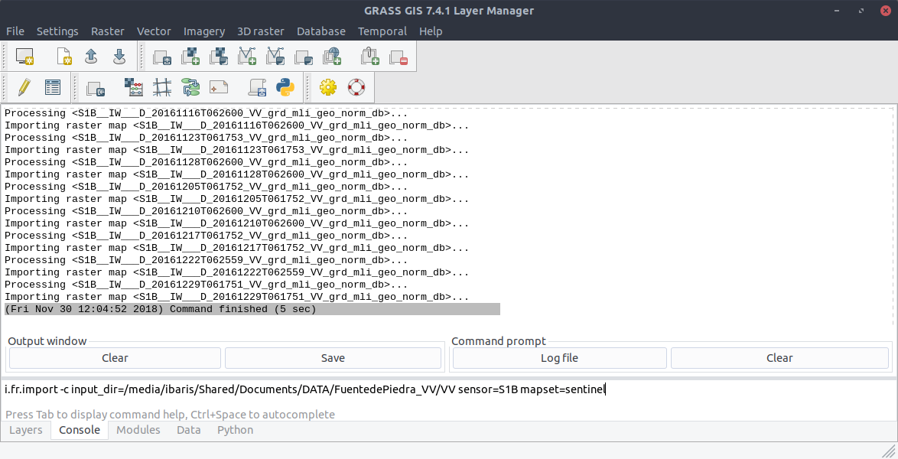
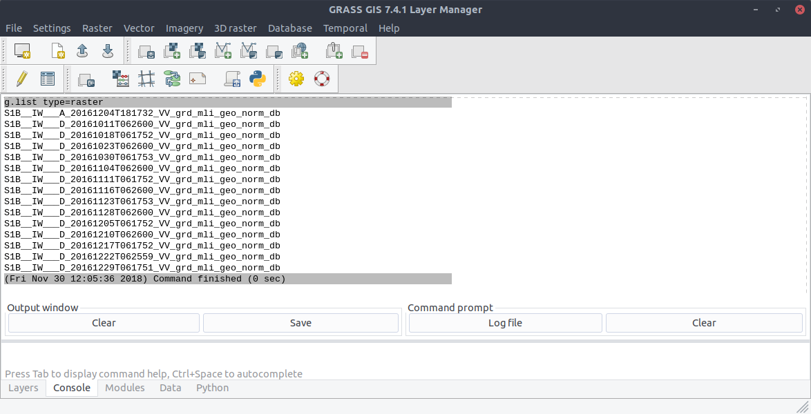

Find Processed Scenes
---------------------
After we downloaded the Sentinel 1 Files with ``pr.geocode`` all the processed files are find in the output directory:

In this directory their are S1A scenes as well as S1B scenes. Consider a case where we want to find and import all the
sentinel 1B scenes. Thus, we can run the command::

    $ i.fr.import -p input_dir=/media/ibaris/Shared/Documents/DATA/FuentedePiedra_VV/VV sensor=S1B

to print all the detected scenes:

We can import all the detected scenes if we delete the flag ``-p``::

    $ i.fr.import input_dir=/media/ibaris/Shared/Documents/DATA/FuentedePiedra_VV/VV sensor=S1B

To be sure we can run the command ``g.list type=raster``:

