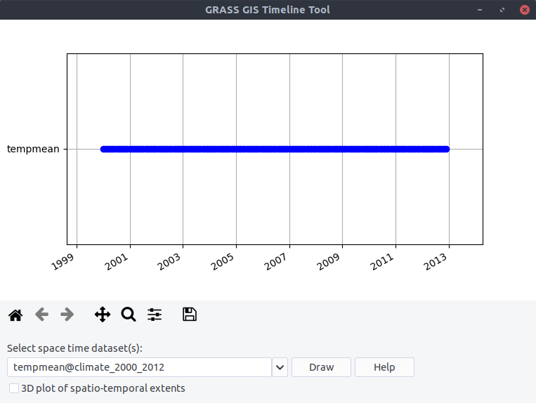
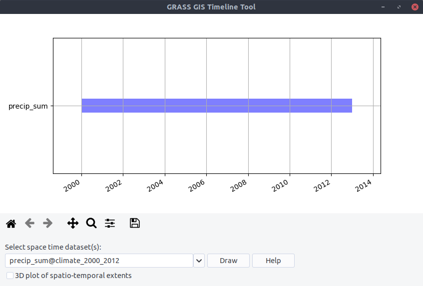
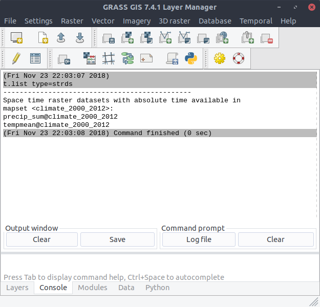

Spatio-temporal data handling
-----------------------------
To better handle the long time series of maps, we create temporal datasets which serve as containers for the time
series and we will further manipulate them instead of individual maps. Usually, we create empty datasets of type
strds (space-time raster dataset) and after that we register the raster files into the strds.
With ``t.c.register`` we can combine these two steps and with the `flag -m`  we will visualize the temporal extents of
the dataset (Note, that we use absolute time.)::

    $ t.c.register -m -t output=tempmean temporaltype=absolute title="Average temperature"
      description="Monthly temperature average in NC [deg C]" pattern="*tempmean" start=2000-01-01
      increment="1 months"

For the preciptation dataset::

    $ t.c.register -m -t output=precip_sum title="Preciptation"
      description="Monthly precipitation sums in NC [mm]" pattern="*precip" start=2000-01-01
      increment="1 months" semantictype=sum

Look at the temporal extents:

With ``t.list type=strds`` we can see the new created datasets::

    $ t.list type=strds

