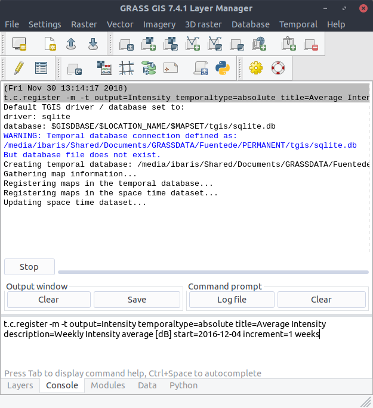
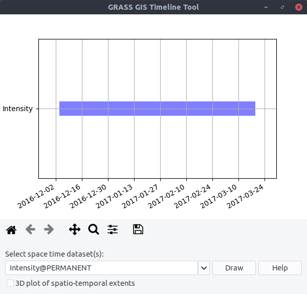

Spatio-temporal data handling with Sentinel Data
------------------------------------------------
After the process of geocoding and import of the scenes we create a huge amount of data as shown in section
*Find Processed Scenes*. To better handle the long time series of maps, we create temporal datasets which serve as
containers for the time series and we will further manipulate them instead of individual maps. Usually, we create empty
datasets of type strds (space-time raster dataset) and after that we register the raster files into the strds.
With ``t.c.register`` we can combine these two steps and with the `flag -m`  we will visualize the temporal extents of
the dataset (Note, that we use absolute and weekly time.)::

    $ t.c.register -m -t output=Intensity temporaltype=absolute title="Average Intensity"
      description="Weekly Intensity average in [dB]" start=2016-12-04
      increment="1 weeks"

Look at the temporal extents:

