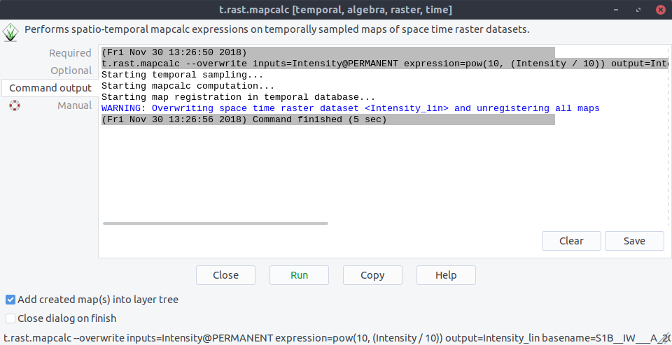
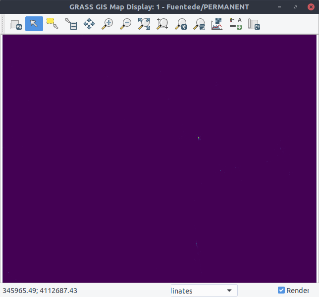

Spatio-temporal Calculation with Sentinel Data
----------------------------------------------
In the previous step we create a spatio-temporal dataset in unit dB. Now, we will convert the dB units to linear unit
with ``t.raster.mapcalc``. To do this we launch the mapcalc GUI with::

    $ t.rast.mapcalc

We choose the space time raster dataset that we created in the previous step `Intensity`. To convert the unit [dB] in
[linear] we use the formula::

    pow(10, (dB/10))

.. image:: _static/t_rast_mapcalc_1.png
   :scale: 50 %
   :alt: Create a Mapset
   :align: center

Now, we will click ``Run``:

If we now list all spatio-temporal dataset we see two entries: The one for ``Intensity`` and the another one
``Intensity_lin`` that we created in with ``t.raster.mapcalc``:

.. image:: _static/t_rast_mapcalc_3.png
   :scale: 50 %
   :alt: Create a Mapset
   :align: center

We can also import the dataset into the display. Here is the dataset in unit [dB]:

.. image:: _static/t_rast_mapcalc_4.png
   :scale: 50 %
   :alt: Create a Mapset
   :align: center

And here is the dataset in unit [linear]:

